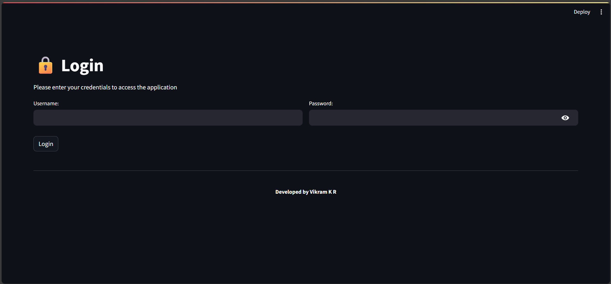
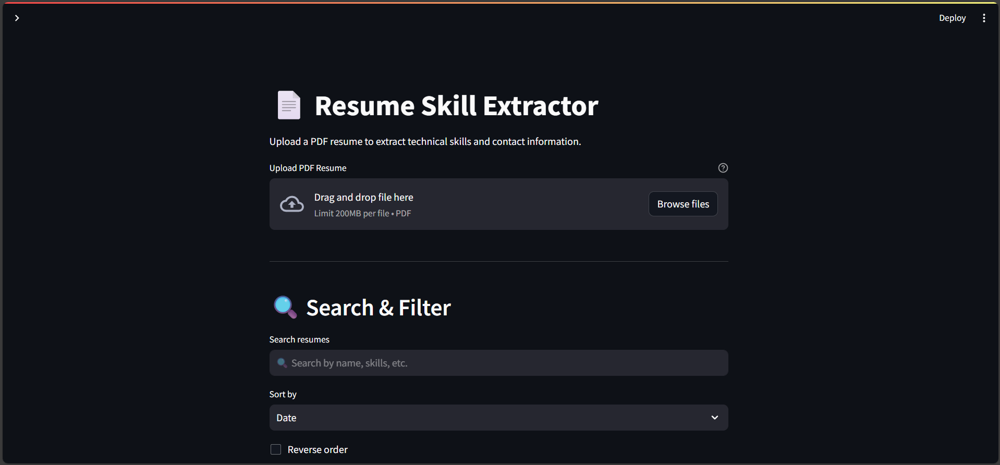
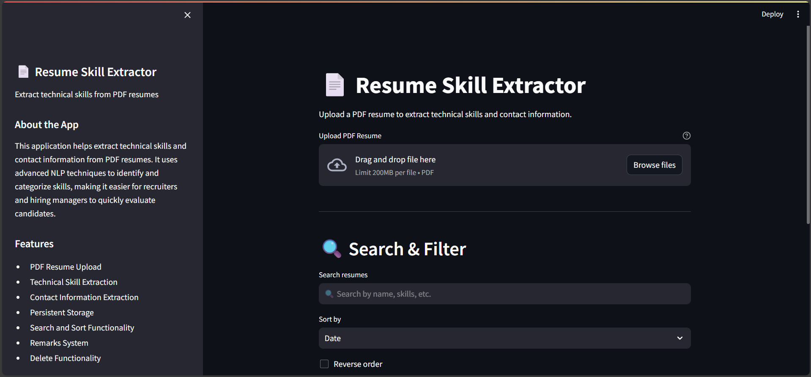

# Resume Skill Extractor

## Project Overview

A powerful web application that extracts technical skills and contact information from PDF resumes using advanced natural language processing techniques. Built with Python and Streamlit, it provides an intuitive interface for recruiters and hiring managers to quickly evaluate candidate resumes.

## Features

- **Resume Processing**
  - Upload PDF resumes
  - Extract technical skills with NLP
  - Extract contact information (name, email, phone)
  - Persistent storage of results

- **Search & Filter**
  - Search through filenames, names, emails, skills, and remarks
  - Real-time search updates
  - Sort by date, name, or skills count

- **Result Management**
  - View previous extractions
  - Add and edit remarks
  - Delete unwanted results
  - Organized display with expandable sections

- **Modern UI**
  - Clean, professional design
  - Interactive sidebar with app information
  - Developer profile with social links
  - Technical details section

## Tech Stack

- **Backend**
  - Python 3.11+
  - spaCy for NLP
  - NLTK for text processing
  - SQLite for storage

- **Frontend**
  - Streamlit for web interface
  - HTML/CSS for styling

- **Development Tools**
  - Black for code formatting
  - Flake8 for linting
  - Pytest for testing
  - Isort for import sorting

## How to Run

### Local Development

1. Create and activate virtual environment:
```bash
python -m venv venv
venv\Scripts\activate
# On Linux: source venv/bin/activate  
```

2. Install dependencies:
```bash
pip install -r requirements.txt

# Install spaCy model
python -m spacy download en_core_web_sm

# Download NLTK data
python -c "import nltk; nltk.download('punkt'); nltk.download('stopwords')"
```

3. Run the application:
```bash
streamlit run app.py
```

The application will be available at `http://localhost:8501`

### Docker

1. Build the Docker image:
```bash
docker build -t resume-skill-extractor .
```

2. Run the container:
```bash
docker run -p 8501:8501 resume-skill-extractor
```

The application will be available at `http://localhost:8501`

## Sample Screenshot




## Usage

1. Open your web browser and navigate to http://localhost:8501
2. Login with credentials:
   - Username: hradmin
   - Password: hradmin123
3. Use the interface to:
   - Upload PDF resumes
   - Extract and analyze skills
   - Generate professional summaries
   - Categorize resumes
   - Add remarks
   - Search and filter results
   - Manage stored results

## Development Timeline

- Built in just 9 hours of coding with AI assistance
- 1 day of research and documentation work
- Developed by Vikram K R
   - Click the "Upload your resume PDF" button
   - Select a PDF file from your computer
   - Click "Extract Skills" to process the resume

2. **View Results**:
   - Extracted information will be displayed in a clean format
   - Results are automatically saved to `results.json`
   - Previous extractions can be viewed in the "Previous Extractions" section

3. **Search and Sort**:
   - Use the search box to find specific results
   - Choose from various sorting options in the dropdown
   - Results update in real-time

4. **Add Remarks**:
   - Click on any previous result to expand it
   - Add notes in the remarks section
   - Click "Save Remarks" to persist your notes

5. **Manage Results**:
   - Delete unwanted results using the delete button
   - Results are automatically sorted based on your selection
   - View all information in an organized layout

## Contributing

Feel free to add more skill keywords to the `SKILL_KEYWORDS` list in the code to enhance the skill extraction capabilities.

The extractor currently supports a wide range of skills including:
- Programming languages (Python, Java, JavaScript, etc.)
- Frameworks (React, Angular, Vue.js, etc.)
- Cloud platforms (AWS, Azure, GCP)
- Databases (MySQL, PostgreSQL, MongoDB)
- DevOps tools (Docker, Kubernetes, Git)
- And many more...
